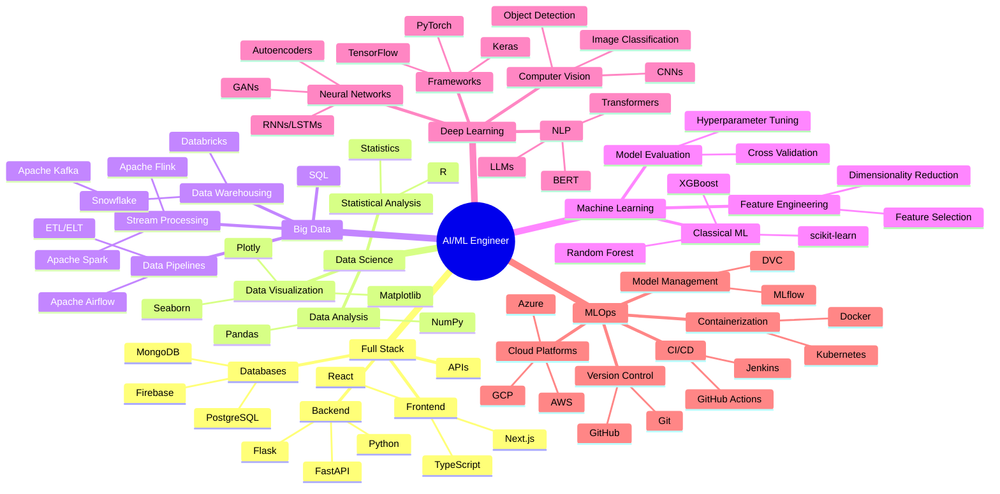
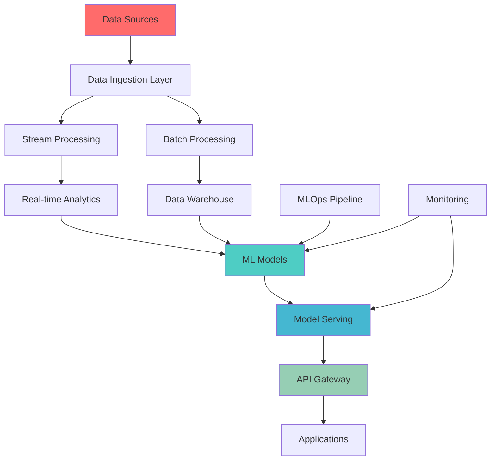

<div align="center">
  
<!-- Animated Typewriter Header -->
<a href="https://git.io/typing-svg">
  
</a>

<!-- Professional Subtitle -->
<a href="https://git.io/typing-svg">
  
</a>

<!-- Profile Stats Badges -->
<div style="margin: 20px 0;">
  
  
  
  
</div>

<!-- Animated Wave -->


</div>

---

## 🚀 About Me


```yaml
name: Jagadesh Chilla
role: AI Engineer & Data Scientist
location: India
focus: [Deep Learning, Machine Learning, Big Data]
current_work: Learning and building AI/ML projects
learning: Advanced Deep Learning, MLOps & Big Data Technologies
collaboration: Open to learning and contributing to projects
```

- 🔭 Currently learning **Deep Learning, Neural Networks & Generative AI**
- 🌱 Exploring **Big Data Technologies, MLOps & Advanced AI Systems**
- 👯 Looking to collaborate on **AI/ML Projects & Open Source Contributions**
- 💬 Ask me about **Deep Learning, Computer Vision, NLP, Big Data**
- ⚡ Fun fact: **I'm passionate about turning data into insights! 📊 → 🧠**

<h2 align="center">🗺️ Skills Roadmap</h2>

<div align="center">



</div>

---

<h2 align="center">🛠️ Technology Arsenal</h2>

### 🤖 Generative AI & LLMs
<div align="center">
  


</div>

### 🧠 Machine Learning & Deep Learning
<div align="center">


</div>

### 🔬 Deep Learning Specializations
<div align="center">


</div>

### 💾 Big Data & Analytics
<div align="center">


</div>

### 🗄️ Databases & Storage
<div align="center">


</div>

### ☁️ Cloud & DevOps
<div align="center">


</div>

### 🌐 Web Frameworks & APIs
<div align="center">


</div>

### 💻 Programming Languages
<div align="center">


</div>

---

<h2 align="center">📊 GitHub Analytics</h2>

<div align="center">
   
  
  
</div>

<div align="center">
  
</div>

<div align="center">
  
</div>

---

<h2 align="center">🎯 Featured Projects</h2>

<div align="center">
  <table>
    <tr>
      <td width="50%">
        <h3 align="center">🤖 LLM Fine-tuning Framework</h3>
        <div align="center">
          <a href="#" target="_blank">
            
          </a>
          <br>
          <p><strong>🔧 LLaMA | LoRA | PEFT | Transformers</strong></p>
          <p>Advanced framework for fine-tuning large language models with parameter-efficient techniques.</p>
        </div>
      </td>
      <td width="50%">
        <h3 align="center">🧠 Multi-Agent AI System</h3>
        <div align="center">
          <a href="#" target="_blank">
            
          </a>
          <br>
          <p><strong>🤝 LangChain | CrewAI | AutoGen</strong></p>
          <p>Sophisticated multi-agent system for collaborative AI problem-solving and task automation.</p>
        </div>
      </td>
    </tr>
    <tr>
      <td width="50%">
        <h3 align="center">📊 Real-time Analytics Pipeline</h3>
        <div align="center">
          <a href="#" target="_blank">
            
          </a>
          <br>
          <p><strong>⚡ Kafka | Spark | PostgreSQL</strong></p>
          <p>High-throughput real-time data processing pipeline with advanced analytics capabilities.</p>
        </div>
      </td>
      <td width="50%">
        <h3 align="center">🔍 Computer Vision Suite</h3>
        <div align="center">
          <a href="#" target="_blank">
            
          </a>
          <br>
          <p><strong>👁️ YOLO | OpenCV | PyTorch</strong></p>
          <p>Comprehensive computer vision toolkit for object detection, segmentation, and recognition.</p>
        </div>
      </td>
    </tr>
  </table>
</div>

<div align="center">
  <a href="https://github.com/jagadeshchilla?tab=repositories" target="_blank">
    
  </a>
</div>

---

<h2 align="center">📈 AI/ML Project Progress</h2>

<div align="center">

| 🎯 Project | 🏷️ Category | 🛠️ Tech Stack | 📊 Progress |
|------------|-------------|---------------|-------------|
| **Generative AI Platform** | LLMs & GenAI | OpenAI, LangChain, FastAPI |  |
| **MLOps Automation** | DevOps & ML | Docker, K8s, MLflow |  |
| **Agentic AI Framework** | Multi-Agent | CrewAI, AutoGen |  |
| **Big Data Pipeline** | Data Engineering | Spark, Kafka, Informatica |  |
| **Computer Vision API** | Deep Learning | PyTorch, YOLO, OpenCV |  |

</div>

---

<h2 align="center">🏗️ System Architecture</h2>

<div align="center">



</div>

---

<h2 align="center">🔗 Let's Connect & Collaborate</h2>

<div align="center">
  
[](https://linkedin.com/in/jagadeshchilla)
[](https://kaggle.com/jagadeshchilla)
[](https://github.com/jagadeshchilla)
[](mailto:jagadeshchilla@gmail.com)

</div>

---

<div align="center">
  
  
  <br>
  
  
  
  <br><br>
  
  <b>✨ Profile crafted with passion for AI & innovation ✨</b>
  <br>
  <sub><b>Last Updated:</b> December 2024</sub>
</div>
