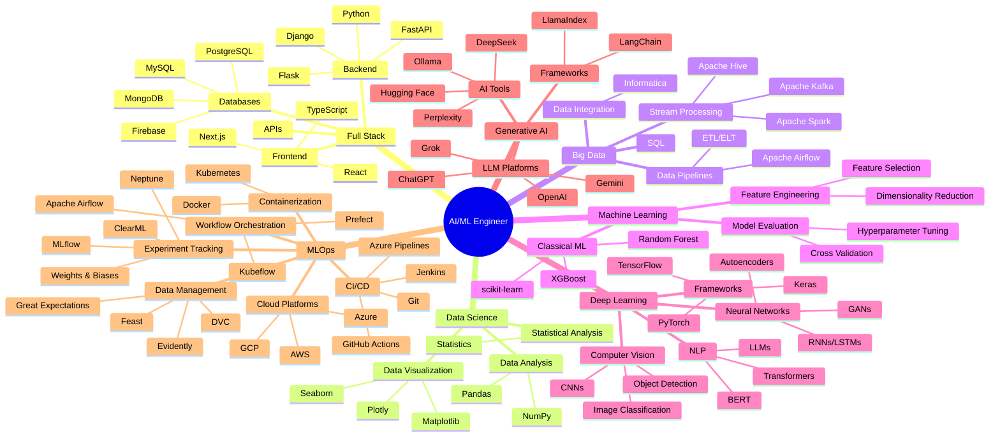

<div align="center">
  
<!-- Animated Typewriter Header -->
<a href="https://git.io/typing-svg">
  
</a>

<!-- Professional Subtitle -->
<a href="https://git.io/typing-svg">
  
</a>

<!-- Profile Stats Badges -->
<div style="margin: 20px 0;">
  
  
  
  
</div>

<!-- Animated Wave -->


</div>

---

## 🚀 About Me


```yaml
name: Jagadesh Chilla
role: AI Engineer & Data Scientist
location: India
focus: [Deep Learning, Machine Learning, Big Data]
current_work: Learning and building AI/ML projects
learning: Advanced Deep Learning, MLOps & Big Data Technologies
collaboration: Open to learning and contributing to projects
```

- 🔭 Currently learning **Deep Learning, Neural Networks & Generative AI**
- 🌱 Exploring **Big Data Technologies, MLOps & Advanced AI Systems**
- 👯 Looking to collaborate on **AI/ML Projects & Open Source Contributions**
- 💬 Ask me about **Deep Learning, Computer Vision, NLP, Big Data**
- ⚡ Fun fact: **I'm passionate about turning data into insights! 📊 → 🧠**

<h2 align="center">🗺️ Skills Roadmap</h2>

<div align="center">



</div>

---

<h2 align="center">🛠️ Technology Arsenal</h2>

### 🤖 Generative AI & LLMs
<div align="center">
  


</div>

### 🧠 Machine Learning & Deep Learning
<div align="center">


</div>

### 🔬 Deep Learning Specializations
<div align="center">


</div>

### 💾 Big Data & Analytics
<div align="center">


</div>

### 🗄️ Databases & Storage
<div align="center">


</div>

### ☁️ Cloud & DevOps
<div align="center">


</div>

### 🔄 MLOps & Data Engineering
<div align="center">


</div>

### 🌐 Web Frameworks & APIs
<div align="center">


</div>

### 💻 Programming Languages
<div align="center">


</div>

---

<h2 align="center">📊 GitHub Analytics</h2>

<div align="center">
   
  
  
</div>

<div align="center">
  
</div>

<div align="center">
  
</div>

---

<h2 align="center">🔗 Let's Connect & Collaborate</h2>

<div align="center">
  
[](https://www.linkedin.com/in/chilla-jagadesh-532246223/)
[](https://github.com/jagadeshchilla/jagadeshchilla)
[](mailto:chillajagadesh68@gmail.com)

</div>

---

<div align="center">
  
  
  <br>
  
  
  
  <br><br>
  
  <b>✨ Profile crafted with passion for AI & innovation ✨</b>
  <br>
  <sub><b>Last Updated:</b> December 2024</sub>
</div>
